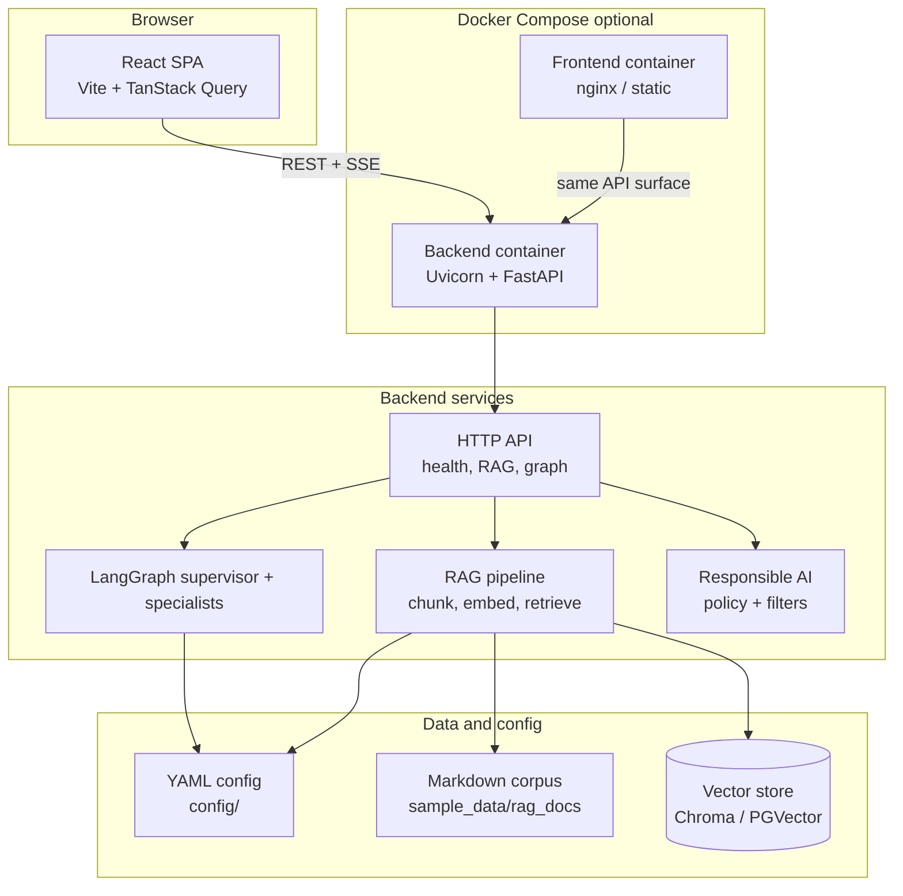

# GovFlow AI

**GovFlow AI** is a production-minded reference application for **secure, auditable AI** in government-style operations. It combines a **FastAPI** backend, **LangGraph** multi-agent workflows, **retrieval-augmented generation (RAG)** with pluggable vector stores, **responsible-AI guardrails**, and a **React + Vite** operator console with health telemetry, grounded Q&A, workflow simulation, and streaming chat.

The codebase is structured so configuration drives behavior: **environment variables** for secrets and deployment, **YAML under `config/`** for prompts, RAG, and policy packs, and **typed settings** on the backend plus **`VITE_*`** on the frontend. Optional integrations (LLMs, live embeddings) **degrade gracefully** when credentials are absent.

All materials under `sample_data/` are **synthetic** and for demonstration only. They do not constitute official guidance or legal advice.

---

## Architecture



---

## Features at a glance

| Area | What ships in this repository |
| --- | --- |
| **API** | Liveness and readiness, RAG ingest and query, LangGraph demo snapshot, synchronous invoke, SSE streaming |
| **Agents** | Supervisor with routing to workflow, research, and document specialists; deterministic fallback when the LLM path is off |
| **RAG** | YAML-driven loaders, chunking, OpenAI or fake embeddings, Chroma or Postgres/pgvector, citation-aware QA prompts |
| **Security** | CORS, optional trusted hosts, explicit security headers, request correlation IDs |
| **Frontend** | Operations dashboard, policy assistant with SSE, workflow simulator |
| **Ops** | Dockerfiles, Compose stack, structured logging, CI-oriented pytest and Vitest suites |

---

## Prerequisites

- **Python 3.12+** and [uv](https://docs.astral.sh/uv/) (recommended), or pip with a virtual environment
- **Node.js 20+** and npm
- **Docker Desktop** (or a compatible engine) for container-based demos

---

## Local setup

### 1. Environment file

From the repository root:

```powershell
copy .env.example .env
```

Adjust `.env` for your machine. At minimum, confirm **`GOVFLOW_RAG_SOURCE_DIR`** points at `sample_data/rag_docs` (default) and **`VITE_GOVFLOW_API_BASE_URL`** matches where the API listens.

### 2. Backend

Keep paths consistent by using the **repository root** as the working context when loading `.env`.

```powershell
cd backend
uv sync --extra dev
uv run pytest
```

Start the API (from `backend/`; ensure `.env` at repo root still applies, or see `backend/README.md` if you start processes elsewhere):

```powershell
cd backend
uv run uvicorn govflow_backend.main:app --reload --host 127.0.0.1 --port 8000
```

### 3. Frontend

```powershell
cd frontend
npm install
npm run test
npm run dev
```

Vite reads **`VITE_*`** variables from the **repository root** (see `frontend/vite.config.ts`).

### 4. Optional: regenerate sample PDFs

Five companion PDFs live under `sample_data/policies/pdf/`. To rebuild them:

```powershell
cd backend
uv run --with fpdf2 python ../scripts/generate_sample_pdfs.py
```

---

## Docker Compose

Build and run the full stack (backend plus static frontend):

```powershell
docker compose up --build          # attached: logs in the terminal
docker compose up --build -d       # detached: services in the background
```

- **API:** `http://localhost:8000` (or the host port from `GOVFLOW_BACKEND_PORT`)
- **UI:** `http://localhost:5173` by default (`FRONTEND_HOST_PORT`)

Compose reads **`env_file: .env`**. For the **built** SPA to call the API from your browser, set **`VITE_GOVFLOW_API_BASE_URL`** in `.env` to an origin reachable from the host (typically `http://localhost:8000`).

The compose file mounts **`./data/chroma`** for Chroma persistence across restarts.

---

## Environment variables and configuration

| Category | Mechanism |
| --- | --- |
| Process / container env | Root `.env` (documented in `.env.example`) |
| Layered YAML | `config/app.*.yaml`, `config/rag.*.yaml`, `config/prompts/agents.*.yaml`, `config/responsible_ai.*.yaml`, `config/logging.*.yaml` |
| Frontend public vars | **`VITE_*` only** (inlined at build time in Docker images) |

**High-signal variables**

| Variable | Role |
| --- | --- |
| `GOVFLOW_ENV` | Selects YAML overlay suffix (`development`, `staging`, `production`) |
| `GOVFLOW_CONFIG_DIR` | Directory containing merged `config/` trees |
| `GOVFLOW_OPENAI_API_KEY` | Optional; omit for degraded LLM paths where supported |
| `GOVFLOW_OPENAI_MODEL` | Optional override of YAML default chat model (`app.llm.default_chat_model`) |
| `GOVFLOW_RAG_SOURCE_DIR` | Root for Markdown ingestion (`**/*.md`) |
| `GOVFLOW_RAG_USE_FAKE_EMBEDDINGS` | Deterministic embeddings for CI and offline work |
| `GOVFLOW_RAG_VECTOR_BACKEND` | `chroma` (default) or Postgres via `GOVFLOW_RAG_PG_DSN` |
| `VITE_GOVFLOW_API_BASE_URL` | Browser-facing API origin |
| `VITE_GOVFLOW_GRAPH_STREAM_PATH` | Relative path for graph SSE streaming |

Full lists and security toggles are documented inline in **`.env.example`**.

---

## Sample data layout

- **`sample_data/rag_docs/`** — Recursive Markdown corpus (policies, manuals, workflows) used by default RAG ingestion.
- **`sample_data/policies/pdf/`** — Five short synthetic policy PDFs for download or UI demos (not ingested by the default Markdown-only RAG loader).

See **`sample_data/README.md`** for layout detail and PDF regeneration.

---

## Default prompts

Agent system prompts, routing hints, degraded-routing keywords, and tool metadata live in **`config/prompts/agents.default.yaml`**, with optional overlays such as **`agents.development.yaml`**. RAG QA templates are in **`config/rag.default.yaml`**.

---

## Mapping to “AI Engineer — Application Development” responsibilities

| Job responsibility | Where it appears in GovFlow AI |
| --- | --- |
| Design and ship internal and operator-facing applications | React SPA with routed pages (`frontend/src/pages/`), shared shell, streaming UX |
| Integrate LLM and agent frameworks behind APIs | LangGraph graph, invoke and SSE routes, YAML-driven agent configuration |
| Implement retrieval and grounding | RAG pipeline: loaders, chunking, embeddings, vector store, citation-aware prompts |
| Apply security and privacy-minded defaults | Middleware, headers, responsible-AI YAML, CORS and trusted host controls |
| Build observable, testable services | Structured logging, health endpoints, pytest and API tests |
| Automate quality and delivery | CI workflows, Docker images, Compose for repeatable demos |
| Communicate clearly for stakeholders | This README, `.env.example`, and focused module READMEs |

---

## Interview demo script (about 10 minutes)

1. **Frame (1 min):** GovFlow AI is a credible full-stack slice: agents, RAG, guardrails, and an operator UI, with clean degradation when API keys are absent.
2. **Architecture (2 min):** Walk the Mermaid diagram: browser to API; LangGraph and RAG; config and corpus; vector store.
3. **Health (1 min):** Dashboard — API badge, readiness, refresh actions.
4. **RAG (2 min):** Default or telework / FOIA-style question; mention citations when generative QA is enabled.
5. **Agents (2 min):** Workflow simulator — run a preset; point to `active_agent` and observability in JSON.
6. **Streaming (2 min):** Policy assistant — one short question; SSE path and offline preview fallback if the API stops.
7. **Close (optional):** Compose stack, fake embeddings for CI, synthetic-only `sample_data/`.

---

## Repository map

| Path | Contents |
| --- | --- |
| `backend/` | FastAPI application, LangGraph, RAG, tests |
| `frontend/` | React application and tests |
| `config/` | YAML configuration overlays |
| `sample_data/` | Synthetic Markdown corpus and PDF companions |
| `scripts/` | Utilities (for example PDF regeneration) |
| `docs/` | Supplementary notes |

---

## Disclaimer

Sample documents are fictional. Before any production use, validate requirements with your organization’s security, accessibility, privacy, and legal stakeholders.
