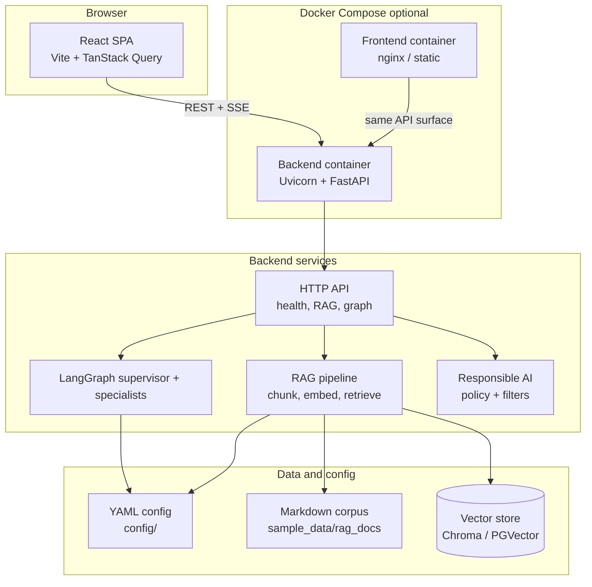

# GovFlow AI

GovFlow AI is a **full-stack reference application** for government-style AI workflows: a **FastAPI** backend with **LangGraph** agents, **retrieval-augmented generation (RAG)** with configurable vector backends, **responsible-AI guardrails**, and a **React + Vite** operator console with streaming chat and workflow simulation.

All sample policies and manuals in `sample_data/` are **synthetic** and for demonstration only—they do not constitute official guidance or legal advice.

## Architecture



## Features at a glance

| Area | What ships in this repo |
| --- | --- |
| API | Health (live/ready), RAG query, LangGraph invoke + SSE stream, demo snapshot |
| Agents | Supervisor routing to workflow, research, and document specialists (with graceful degraded mode) |
| RAG | YAML-driven loaders, chunking, embeddings (OpenAI or fake), Chroma or Postgres/pgvector |
| Security | CORS, trusted hosts, security headers, correlation IDs |
| Frontend | Dashboard, streaming policy assistant, workflow simulator |
| Ops | Dockerfiles, `docker compose`, structured logging, CI-friendly tests |

## Prerequisites

- **Python 3.12+** and [uv](https://docs.astral.sh/uv/) (recommended) *or* pip with a virtual environment
- **Node.js 20+** and npm
- **Docker Desktop** (or compatible engine) for container workflows

## Local setup

### 1. Environment file

From the repository root:

```powershell
copy .env.example .env
```

Edit `.env` for your machine. At minimum, confirm `GOVFLOW_RAG_SOURCE_DIR` points at `sample_data/rag_docs` (default) and `VITE_GOVFLOW_API_BASE_URL` matches where the API listens.

### 2. Backend

Run commands from the repo root so relative paths in `.env` resolve.

```powershell
cd backend
uv sync --extra dev
uv run pytest
```

Start the API:

```powershell
cd backend
uv run uvicorn govflow_backend.main:app --reload --host 127.0.0.1 --port 8000
```

The backend expects `GOVFLOW_CONFIG_DIR` to resolve to the `config/` directory (default when cwd is the repo root and `.env` is loaded from there—see `backend/README.md` if you start Uvicorn from `backend/` only).

### 3. Frontend

```powershell
cd frontend
npm install
npm run test
npm run dev
```

Vite reads `VITE_*` variables from the **repository root** (see `frontend/vite.config.ts`).

### 4. Optional: regenerate sample PDFs

PDF fixtures are committed under `sample_data/policies/pdf/`. To rebuild them:

```powershell
cd backend
uv run --with fpdf2 python ../scripts/generate_sample_pdfs.py
```

## Docker Compose

Build and run the full stack (backend + static frontend):

```powershell
docker compose up --build
```

- **API:** `http://localhost:8000` (or the host port from `GOVFLOW_BACKEND_PORT`)
- **UI:** `http://localhost:5173` by default (`FRONTEND_HOST_PORT`)

Ensure `.env` exists; Compose references it via `env_file`. For the **built** SPA to reach the API from the browser, set `VITE_GOVFLOW_API_BASE_URL` in `.env` to a URL reachable from the host (typically `http://localhost:8000`).

First Chroma persistence: the compose file mounts `./data/chroma` for the vector store.

## Environment variables and configuration

| Category | Mechanism |
| --- | --- |
| Process / container env | Root `.env` (see `.env.example`) |
| Layered YAML | `config/app.*.yaml`, `config/rag.*.yaml`, `config/prompts/agents.*.yaml`, `config/responsible_ai.*.yaml`, `config/logging.*.yaml` |
| Frontend public vars | `VITE_*` only (baked at build time in Docker) |

**High-signal variables**

| Variable | Role |
| --- | --- |
| `GOVFLOW_ENV` | Selects YAML overlay suffix (`development`, `staging`, `production`) |
| `GOVFLOW_CONFIG_DIR` | Directory containing `config/` trees |
| `GOVFLOW_OPENAI_API_KEY` | Optional; omit to run in degraded LLM modes where supported |
| `GOVFLOW_RAG_SOURCE_DIR` | Root for Markdown ingestion (`**/*.md`) |
| `GOVFLOW_RAG_USE_FAKE_EMBEDDINGS` | Use deterministic embeddings for CI / offline |
| `GOVFLOW_RAG_VECTOR_BACKEND` | `chroma` (default) or Postgres DSN via `GOVFLOW_RAG_PG_DSN` |
| `VITE_GOVFLOW_API_BASE_URL` | Browser-facing API origin |
| `VITE_GOVFLOW_GRAPH_STREAM_PATH` | Relative path for SSE streaming |

Full lists and security toggles are documented inline in `.env.example`.

## Sample data layout

- **`sample_data/rag_docs/`** — Recursive Markdown corpus (policies, manuals, workflows) for RAG demos.
- **`sample_data/policies/pdf/`** — Companion PDF excerpts for download or UI demos (not ingested by the default Markdown-only loader).

See `sample_data/README.md` for regeneration commands.

## Default prompts

Agent system prompts, routing hints, and tool metadata live in **`config/prompts/agents.default.yaml`**, with optional overlays such as `agents.development.yaml`. RAG QA prompt templates are in **`config/rag.default.yaml`**.

## Mapping to “AI Engineer — Application Development” responsibilities

Typical responsibilities for an **AI Engineer (Application Development)** role are reflected in this repository as follows:

| Job responsibility | Where it shows up in GovFlow AI |
| --- | --- |
| Design and ship end-user and internal applications | React SPA with routed pages (`frontend/src/pages/`), shared layout, and streaming UX |
| Integrate LLM and agent frameworks into production-style APIs | LangGraph graph, invoke + SSE stream routes, agent configuration YAML |
| Implement retrieval and grounding patterns | RAG service: loaders, chunking, embeddings, vector store, citation-aware prompts |
| Apply security, privacy, and compliance-minded defaults | Security middleware and headers, responsible-AI YAML, CORS and trusted host settings |
| Build observable, testable services | Structured logging, health endpoints, pytest coverage for config, RAG, agents, and HTTP surfaces |
| Automate quality and delivery | CI workflows, Docker images, compose stack for repeatable demos |
| Collaborate through clear documentation | This README, `.env.example`, and module-level `README` files |

## Interview demo script (10 minutes)

1. **Frame the problem (1 min):** “GovFlow AI is a reference gov-style stack: agents + RAG + a operator UI, with degraded modes when keys are absent.”
2. **Show the architecture (2 min):** Walk through the Mermaid diagram above—browser → API → LangGraph / RAG / guardrails → vector store and corpus.
3. **Live health and readiness (1 min):** Open the dashboard; point at API badges and readiness text; hit **Refresh health**.
4. **RAG grounding (2 min):** Use the default RAG question or ask about **telework documentation** or **FOIA timelines**; point at citations in the answer when generative mode is enabled.
5. **Agents — invoke (2 min):** Open **Workflow simulator**; run **Permit workflow** and briefly interpret `active_agent` and observability fields in JSON.
6. **Streaming (2 min):** Open **Assistant**; send a short policy question; mention SSE path and fallback behavior if the API is stopped.
7. **Close (optional):** Mention Docker compose, fake embeddings for CI, and that all federal content in `sample_data/` is synthetic.

## Repository map

| Path | Contents |
| --- | --- |
| `backend/` | FastAPI app, LangGraph, RAG, tests |
| `frontend/` | React application and tests |
| `config/` | YAML configuration overlays |
| `sample_data/` | Synthetic documents and PDFs |
| `scripts/` | Maintenance utilities (e.g. PDF generation) |
| `docs/` | Supplementary notes |

## License and disclaimer

Sample documents are fictional. Verify all requirements with your agency’s counsel, security, and accessibility offices before any production use.
